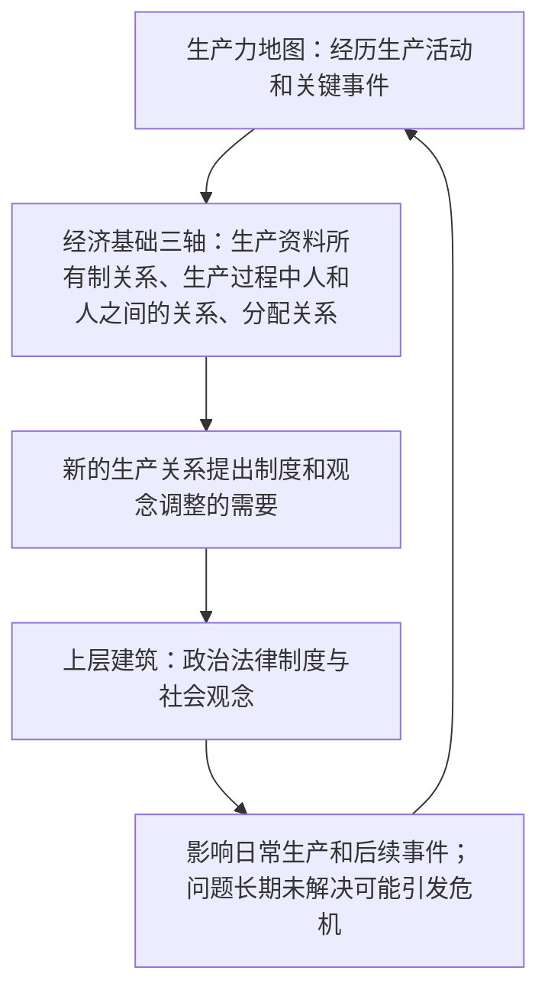
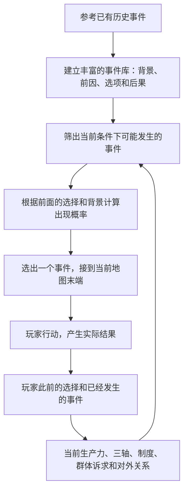
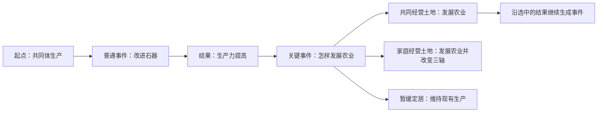
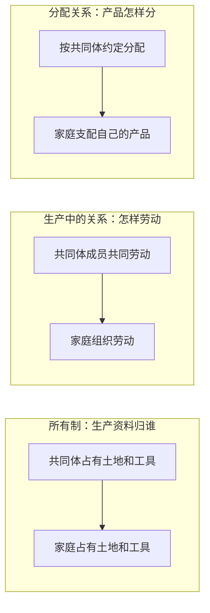
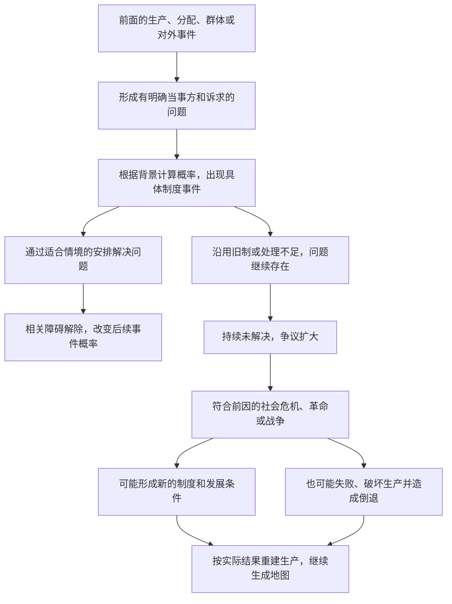
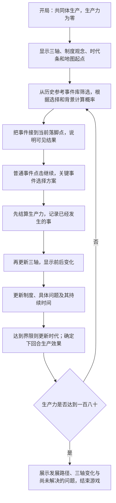

# 经济基础决定上层建筑：游戏设计方案

> 本版以组员提供的[设计原稿](docs/original-readme.md)为主要依据。原稿中的“四轴”按老师确认改为“三轴”。旧版规则和参数由本版及配套文档替代。
>
> **【原有整理】**：整理原稿已有内容。
> **【新增设计】**：为使玩法完整而补充的规则，包括具体数值和例子。
> **【三轴修正】**：落实老师确认的三轴结构。“怎么交换”保留为事件，不单列一轴。
> **【本轮确认】**：按组员最新说明修正地图生成和制度事件逻辑。具体概率、持续回合和损失数值仍属【新增设计】，是可调整的试用规则。

## 一、玩家在做什么

**【原有整理】** 玩家带领一个社会沿生产力地图前进：经历日常生产和关键事件，积累生产力，在旧的生产方式发展受限时寻找突破，并进入新的时代。

**【新增设计】** 玩家还要在事件中决定生产资料归谁、劳动如何组织、产品如何分配。这些生产关系改变后，原有制度和观念可能需要调整；调整是否及时，又会影响以后的生产活动。

全局只保留三个核心模块：

| 模块 | 玩家看见什么 | 它回答什么问题 |
| --- | --- | --- |
| 生产力地图 | 历史事件、当前事件、生产力数值和时代条 | 我们能生产多少，下一步怎样发展？ |
| 经济基础三轴 | 生产资料所有制关系、生产过程中人和人之间的关系、分配关系三张变化图 | 生产资料归谁，人们在生产中是什么关系，产品怎样分？ |
| 上层建筑 | 政治法律制度、社会观念两栏 | 社会怎样管理，人们怎样理解和维护现有关系？ |

前两个模块来自原稿；上层建筑的具体玩法属于新增，用来落实游戏主题。时代条属于生产力地图，不增加第四个模块。

**【新增设计说明】** 这张图表示相互作用。生产力变化提供条件，经济基础由实际生产关系构成；制度和观念变化通过明确事件表现，不能只凭生产力数字自动推导一切。

## 二、保留什么，补充什么

| 内容 | 本版处理 | 来源 |
| --- | --- | --- |
| 唯一起点、有方向的生产力地图 | 新事件接在当前落脚点之后 | 【原有整理】 |
| 普通事件一条路，可以连续出现 | 保留，另补具体重复规则 | 【原有整理】 |
| 关键事件有多个结果，需要先前经历 | 保留，每个选项写明结果 | 【原有整理】 |
| 每个时代有自己的事件库 | 保留 | 【原有整理】 |
| 达到一定生产力进入新时代 | 保留，另补具体界限 | 【原有整理】 |
| 普通生产逐渐受限，关键事件带来突破 | 保留“软性锁”思路，改称“现有生产方式的发展限制” | 【原有整理】 |
| 经济基础轴数 | 生产资料所有制关系、生产过程中人和人之间的关系、分配关系三轴 | 【三轴修正】 |
| 地图生成方式 | 以历史事件为参考建库，根据玩家选择和当前背景计算事件概率，逐步拼接地图 | 【本轮确认】 |
| 未完成的“如何改变四轴” | 由事件结果明确改变三轴，不积累隐藏进度 | 【新增设计】 |
| 上层建筑如何产生和反作用 | 从具体历史推断制度事件；长期不处理会使相关战争、革命等危机进入后续事件 | 【本轮确认】 |
| 开局、重复、补救、结束、数值 | 补全，见下文和规则说明 | 【新增设计】 |

## 三、生产力地图：经历事情，再产生结果

### 地图怎样长出来

**【原有整理】** 地图只有一个起点。普通事件连接一个结果，关键事件连接多个结果。

**【本轮确认】** 制作时先参考已有历史事件，建立足够丰富的地图事件库。每次玩家继续前进，读取已经做过的选择和当前背景，筛出此时可能发生的事件，计算各事件的出现概率，再选出事件接到当前落脚点。选择产生的新背景又会改变下一次事件的概率。因此地图是一边游玩一边由事件拼成的，不是一条提前排好的固定路线。

“当前背景”包括生产力与时代、三轴、现行制度和观念、已经掌握的技术、群体诉求、对外关系，以及尚未解决的问题。后两项必须有前面的事件作为依据。

**【新增设计】** 每个入库事件保留历史参考来源，区分史实背景与为游戏补充的假设分支。先按时代整理，再标明跨时代可出现的制度问题；尚未完成的大事件库不能用少量示例冒充。资料整理表见[事件库编写说明](docs/event-library.md)。

**【新增设计】** 接上事件本身不增加生产力。普通事件点击“继续”后结算；关键事件选择结果后结算。只有实际走过的路径计入历史，未选分支只用于回看。

图中“共同经营”只是一次选择示例；实际选家庭经营或暂缓时，也从相应结果继续。

**【新增设计】** 地图向右表示事件先后，不把横向距离当作生产力数值。生产力显示在节点和顶部数值栏中。遭遇损失时，历史仍向前，生产力可以下降，不会把地图画回过去。

### 两种事件有什么区别

| 类型 | 玩家操作 | 典型结果 | 重复规则 |
| --- | --- | --- | --- |
| 普通事件 | 阅读结果后继续，只有一个出口 | 改进工具、积累经验，或遭遇小规模损失 | 同类活动可以反复发生，每次都是新经历 |
| 关键事件 | 根据具体情境选择方案 | 技术突破、土地与劳动制度变化、战争、革命等 | 技术成功不重复领奖；未解决的问题可发展出新的后续事件，不能手动召回制度事件 |

事件结构来自原稿；具体重复规则属于新增。

## 四、时代怎样变化，为什么不会卡死

**【原有整理】** 保留五个时代及其事件库。生产力达到相应数值后进入新时代。

**【新增设计：首版试用数值】** 生产力是教学用的综合刻度，不对应现实年份或可直接测量的社会指标。

| 当前时代 | 进入时的生产力 | 日常生产最多提高到 | 达到上限后可出现的发展问题 | 发展方案成功后的结果 |
| --- | --- | --- | --- | --- |
| 采集狩猎 | 0 | 16 | 定居与农业 | 增加4，达到20，进入农业与金属工具时代 |
| 农业与金属工具 | 20 | 46 | 组织工场生产 | 增加4，达到50，进入工场手工业与市场时代 |
| 工场手工业与市场 | 50 | 86 | 采用机器生产 | 增加4，达到90，进入机器大工业时代 |
| 机器大工业 | 90 | 136 | 信息技术应用 | 增加4，达到140，进入信息与人工智能时代 |
| 信息与人工智能 | 140 | 176 | 智能生产与成果安排 | 增加4，达到180，进入结局 |

**【新增设计】** 日常生产通常增加4；距离本时代日常生产上限不超过8时增加2；达到上限后不再增加。旧制度阻碍新的生产关系时，上述收益减半，界面直接显示原因和最终数值。增益最多补到日常上限，不能越过它。

例如：“本次改进农具原可增加4；旧的财产规定阻碍家庭经营，本次增加2。”无需让玩家理解系数或公式。

日常生产到达上限后，相应突破进入候选；具体事件仍要结合历史背景计算概率。为避免一直抽不到发展机会，新增一条保底：连续两次可安排突破的机会未抽到它，第三次提供突破。到期危机及其恢复生产优先，处理后继续原来的等待记录，不把计数反复清零。

暂缓不会永久失去机会：先经历两次其他事件，再让发展问题重新进入候选并适用上述保底。这两次经历仍根据背景产生，既可能是日常生产，也可能出现前面选择引出的社会问题。到达日常上限时，继续原有生产不会再增加生产力。

生产力下降不会抹掉已经掌握的技术和已经进入的时代。仍从已进入的时代库继续发展，直到恢复并达到下一次突破条件。这个“时代不因短期损失倒退”的处理属于新增。

## 五、三轴怎样变化

**【三轴修正】** 三轴沿用老师确认的内容，界面同时给出直白解释：

| 正式名称 | 界面解释 |
| --- | --- |
| 生产资料所有制关系 | 土地、工具、机器归谁所有？ |
| 生产过程中人和人之间的关系 | 谁参加劳动，谁组织生产，彼此是什么关系？ |
| 分配关系 | 劳动者得到什么，剩余产品怎样分配？ |

交换、贸易和市场进入事件库，可以影响生产规模和分配关系，不单独构成第四轴。

**【原有整理】** 每一轴都用一张有起点、有方向的变化图展示。

**【新增设计】** 首版采用四组示例关系。它们是便于演示的可选组合，不是完整历史社会形态序列，也不表示所有社会必然按同一路径发展。

| 生产关系示例 | 所有制 | 生产中的关系 | 分配关系 |
| --- | --- | --- | --- |
| 共同体生产 | 共同体占有土地和工具 | 共同体成员共同劳动 | 按共同体约定分配产品 |
| 家庭小生产 | 家庭占有土地和工具 | 家庭组织劳动 | 家庭支配自己的产品 |
| 雇佣生产 | 资本私人占有生产资料 | 资本所有者组织生产，劳动者受雇劳动 | 劳动者取得工资，占有者取得剩余收益 |
| 联合生产 | 生产资料社会共同占有 | 劳动者共同劳动、共同管理 | 按劳分配，并提留公共积累 |

选择生产安排时，界面把三个轴的前后变化分别展开。具体制度事件也可以只改变有依据的一项关系或一条规定，不要求每次同时更换三轴；任何变化都要说明与其余关系如何衔接。

例如，选择“家庭经营土地”后，三轴一次明确改为“家庭占有—家庭劳动—家庭支配产品”，不需要先积累到某个隐藏分数。

这三条变化来自同一个农业事件的同一次选择。其余变化和触发事件见[规则说明](docs/algorithms.md)。

## 六、上层建筑怎样体现决定和反作用

**【新增设计】** 上层建筑用两栏文字展示，不建立另一套需要计算的升级树。

| 当前生产关系 | 政治法律制度示例 | 社会观念示例 |
| --- | --- | --- |
| 共同体生产 | 共同体议事和公共劳动约定 | 重视共同协作与共同体责任 |
| 家庭小生产 | 家庭经营权与产品归属约定 | 重视家庭经营和独立生产 |
| 雇佣生产 | 私有财产权、雇佣合同与相应管理制度 | 维护私人财产和契约关系的观念 |
| 联合生产 | 公有财产保护与劳动者参与管理制度 | 重视共同劳动、公共利益和共同责任 |

这些对应关系是教学示例；不同社会还可能有多种政治和观念形式。

共同体阶段展示的是习惯和议事规则，不把它等同于已经形成国家的成熟法律制度。两栏的具体内容随所讨论的社会关系变化。

开局制度与观念符合开局三轴。此后三轴变化，或者实际事件暴露出旧规定的问题时，记录具体不适应之处。例如“家庭经营已经扩大，但产品归属仍按旧共同体规定处理”。上表只作说明，不能把所有问题都归结为更换一套固定制度。

**【本轮确认】** 不固定在下一回合弹出同一个“调整社会制度”事件，也不固定只有“调整／沿用”两个选项。系统依据此前事件、受影响群体和现行规定，推断当前可能出现的具体事件，再计算出现概率。

| 已有经历和背景 | 可能出现的具体事件 | 按情境编写的选择举例 |
| --- | --- | --- |
| 家庭经营扩大，收获物归属有争议 | 土地经营权与产品归属争议 | 确认家庭经营权；改为共同经营并重订分配；维持旧规定 |
| 工场扩张，劳动条件恶化，劳动者已提出诉求 | 工时、报酬与劳动保障争议 | 建立协商和保障规定；改变生产组织；拒绝诉求 |
| 劳动者开始共同管理，但旧管理机构仍独占决策 | 生产管理权争议 | 建立代表议事；重新划分管理职责；保留原机构权限 |
| 前面的分配冲突长期未解决，出现有组织的变革诉求 | 政治变革或革命事件 | 协商改革；支持具体的新制度方案；维护旧秩序，并承担相应后果 |
| 已有资源、边界或贸易冲突，对外交涉又失败 | 战争危机 | 停战交涉；应对冲突并安排恢复；继续冲突，承担更大生产损失 |

这些是【新增设计】的情境示例，不是所有事件通用的一组选项。具体选项分别说明会改变哪些规定、哪些三轴关系，解决哪个问题，又可能留下什么问题。政治法律制度和社会观念可以分开变化，不要求一次同步更新。

**【本轮确认】** 选择暂时沿用旧制后，没有可随时点击的“讨论制度调整”入口。问题留在历史中，后续事件会继续受它影响。长期不处理，矛盾可能通过生产中断、社会运动、革命或有相应对外背景的战争等关键事件表现出来。

**【新增设计：试用节奏】** 同一个问题持续三个回合未解决时，保证出现一次与它有关的公开争议；持续六个回合仍未解决时，保证出现符合背景的严重危机。具体是何种事件仍根据前因和概率选择。更换时代、关闭事件或只作部分让步都不能把原问题的持续时间清零。

制度状态本身不直接赠送生产力；事件中的战争破坏、停产和重建可以明确改变生产力。革命和战争不保证成功或进步：可能改变制度，也可能失败、留下新矛盾或使生产力倒退。没有群体组织和变革诉求，不能凭空抽到革命；没有相关对外冲突，不能把长期未调整直接等同于战争。

## 七、从开局到结束的完整链路

**【新增设计】** 首版统一从生产力0、采集狩猎时代、共同体生产开始。初始三轴和制度彼此对应，避免石器阶段直接拥有现代工业社会的初始条件。

规则按固定顺序结算。当前选择改变的制度只影响以后的生产活动，不能反过来改写同一次事件的收益。

**【新增设计】** 结局不仅显示“达到180”，还展示走过的时代、关键选择、三轴变化、哪些制度曾阻碍生产、玩家怎样处理。达到同一生产力可以拥有不同的生产关系和制度安排。

## 八、哪些旧术语不再使用

**【新增设计：简化表达与规则】** 以下不是简单改名：没有必要的计算直接删除。

| 旧版名称 | 本版处理 |
| --- | --- |
| 顶峰线 | 显示“本时代日常生产上限”，时代条直接画出来 |
| 残差权重 | 删除；记录改变前后的生产关系，旧制度保留即可体现不同步 |
| 进度提交线 | 删除；事件说明三轴怎样变化，选择后直接发生 |
| 抽取倍率 | 玩家看到“事件出现的可能性”；程序根据具体背景计算概率，不把倍率作为玩家要学习的概念 |
| 轴偏向 | 删除；把生产关系方案直接写入关键事件选项 |
| 修正偏置 | 删除；显示“日常生产受阻，增益减半”及具体原因 |
| 矛盾数值 | 不设抽象总分；记录具体问题及已经持续多久，解释为什么后续争议升级 |
| 寻常点亮的矛盾上限 | 删除；制度调整不受隐藏数值阻止 |
| 门闩 | 改为“需要先完成的事件”，直接列出 |

玩家只需持续理解三件事：**生产力到哪里了、生产关系怎样了、现行制度是否适应。**

## 九、怎样把首版做出来

**【新增设计】** 先用小型样例库验证五个时代的发展、背景影响概率、具体制度事件、长期矛盾与危机后恢复，再按历史资料扩充正式事件库。五个发展问题只是贯通时代的参考骨架，不是整张地图的固定剧本。

1. 先做数值推演，验证能从0发展到180，暂缓和损失后还能继续。
2. 再做地图、三轴图和时代条，让玩家看懂每次变化。
3. 最后补充历史案例，由老师核对理论表述。奴隶制、封建制等关系可后续扩充；首版不把四组示例宣称为完整历史。

本版定位为课堂讨论型游戏。玩家需要观察自己的选择怎样影响后续事件，并承担长期不处理问题的后果。概率、危机出现时机和生产损失仍需试用，不保证任意选择都能进步或通关。

配套文档：

- [完整玩法链路](docs/gameplay-flow.md)：一局怎样走，以及具体回合示例。
- [核心模块关系图](docs/module-graph.md)：三个模块各自负责什么、如何传递结果。
- [规则说明](docs/algorithms.md)：开发时统一采用的具体规则；保留文件名，正文使用中文。
- [规则核验](docs/design-validation.md)：数值可达性、失败补救和验证范围。
- [事件库编写说明](docs/event-library.md)：历史参考如何转换为条件、概率和具体事件。
- [设计原稿](docs/original-readme.md)：用户文件的原文副本，便于核对来源。
