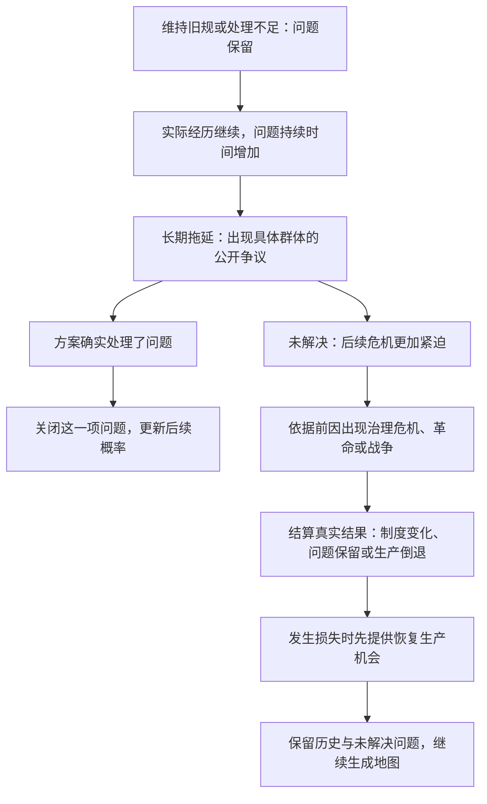

# 规则说明：事件概率、社会矛盾与历史发展

以[主方案](../README.md)为入口。【原有整理】保留历史地图、时代和事件结构；【本轮确认】落实玩家选择与背景决定事件概率、具体情境产生制度事件、长期未调整引发危机；下文数字和实现边界均为【新增设计】的试用规则。

三轴正式名称统一为：**生产资料所有制关系、生产过程中人和人之间的关系、分配关系**。简短图例可以使用“生产资料归谁”“人们怎样共同生产”“产品怎样分”，不能替换正式定义。

## 一、需要记录的背景

| 内容 | 用途 |
| --- | --- |
| 生产力、已经进入的时代、已经掌握的技术 | 判断生产活动和技术突破条件 |
| 已经发生的事件、玩家实际选择 | 改变后续候选和出现概率 |
| 当前三轴、现行制度与观念的具体内容 | 判断哪些规定支持或阻碍当前生产 |
| 群体诉求、组织活动、对外关系 | 给社会运动、革命、战争提供前因 |
| 尚未解决的问题 | 每项记下起因、当事方、诉求、持续回合、是否阻碍生产、是否已公开争议 |
| 当前事件及其结算记录 | 防止双击、读档重复领取和跳回未选分支 |
| 普通损失记录、发展机会等待次数、危机后恢复次数 | 防止事件断路、无限等待或连续危机挤掉恢复机会 |

问题需要稳定的记录。同一土地争议不能因为更换事件标题就变成新问题，也不能因进入新时代而消失。多个问题并存时分别记录，不叠加成玩家看不懂的总分。

## 二、开局与结束

开局为生产力0、采集狩猎、共同体生产，以及相应的共同体规则和观念。未发生的群体冲突和对外争端不能预先当作历史。

生产力达到180，本回合完整结算后结束，展示三轴、制度、危机和未解决问题。达到180只表示完成本次生产发展目标，不代表社会一切矛盾已解决；不额外弹出通用制度二选一。

## 三、时代与发展空间

【原有整理】按生产力进入新时代，各时代有相应事件库。

【新增设计】以下只提供贯通时代的发展骨架，不排定普通与社会事件的顺序：

| 时代 | 进入界限 | 日常上限 | 关键发展主题 | 必须已经完成的经历 | 发展方案的生产力变化 |
| --- | --- | --- | --- | --- | --- |
| 采集狩猎 | 0 | 16 | 定居与农业 | 无 | 增加4 |
| 农业与金属工具 | 20 | 46 | 组织工场生产 | 已发展农业 | 增加4 |
| 工场手工业与市场 | 50 | 86 | 采用机器生产 | 已组织工场生产 | 增加4 |
| 机器大工业 | 90 | 136 | 信息技术应用 | 已采用机器生产 | 增加4 |
| 信息与人工智能 | 140 | 176 | 智能生产与成果安排 | 已应用信息技术 | 增加4，达到180结束 |

达到日常上限才让该发展主题进入候选。具体模板还须符合先前选择和背景；每个阶段必须有不依赖随机支线的基本发展方案。主题成功只记一次，未选结果不算完成。

暂缓后先经历两次其他事件再恢复候选资格。此后在可安排突破的机会中，连续两次没有抽中，第三次提供一个符合背景的突破事件。强制危机与危机后恢复不占用这些机会，不清零已经积累的等待次数；生产力因损失低于上限时暂不参加，恢复后继续。

生产力下降不删除技术和已进入时代，但新的事件仍需检查当前生产能力。知道机器原理不等于工厂未受战争破坏。旧时代尚未解决的问题可以在新时代继续出现。

## 四、怎样从事件库计算概率

【本轮确认】先以历史事件为参考建库，再由已有选择和现有背景计算概率，抽到什么就把什么接上地图。

【新增设计】采用一套简单、可解释的初始算法：

1. 先筛选发生条件：时代与当前能力、已完成经历、具体群体或对外背景、尚未解决的问题，以及重复限制。不满足的事件本轮不会出现。
2. 每个合格事件默认有1份出现机会。每满足一项模板写明的相关背景，多加2份。每项依据只能计算一次；不同程度的同一问题只能取当前程度，不能重复相加。
3. 某事件的概率，等于它的机会份数除以所有候选的机会份数总和。抽取一次后固定当前事件，不因刷新页面重新抽取。
4. 玩家确认结果后更新历史和背景，下一次再重新筛选、计算。前面选择能同时改变“有没有资格出现”和“有多大可能出现”。

例：当前只有“土地归属争议”“改进灌溉”“修整农具”三个候选。家庭经营扩大是土地争议的一项相关背景，三项分别有3、1、1份机会，即60%、20%、20%。若没有土地归属问题，土地争议不进入候选，而不是凭空保留一个低概率。

这是计算示例，不是整局固定概率。正式事件数量扩大后应检查内容类别是否被大量同类模板挤占；同一事件的不同文案只抽中后再选，不重复算成多个候选。

为保证能继续游玩，少数到期事件优先处理，具体顺序见第八节。普通时刻仍按上述概率抽取。开发日志保留使用了哪些历史依据；玩家看到“因家庭经营扩大，更可能发生土地归属争议”等中文解释。

## 五、生产力怎样变化

正收益日常活动：距离日常上限大于8时增加4，距离为8或更少时增加2。若有明确阻碍生产的未解决问题，减半一次，分别增加2或1。最多补到日常上限，不越过上限。

只影响观念或对外关系、尚未影响生产的争议不自动扣日常增益。多个阻碍不连续减半；具体问题和代价写在事件说明里。

普通小损失为减少1，任意连续三次普通事件最多一次小损失，跨时代检查。没有正收益普通活动时，使用当前时代的“继续改进现有生产”模板补位。

战争、革命、生产中断属于关键事件，不受普通小损失上限约束。初始危机样例使用减少4或8，具体由事件后果说明；成功变革也可能付出短期损失，失败不一定改变制度。所有生产力最低为0。

发生关键事件损失后，优先安排两次恢复生产，每次恢复2，但累计不能超过本次危机前的生产力。即使损失已经补足，也把余下恢复回合作为零增益的重建经历，完成后回归正常事件。恢复期间不抽新危机，也不增加问题持续时间；两次恢复后尚存的生产缺口由普通生产继续弥补。

制度状态本身不直接加减生产力；日常增益由其影响决定，关键事件的实际破坏和重建则作为事件结果结算。不能把战争损失错误地按日常收益减半。

## 六、制度事件必须具体到什么程度

每个制度事件至少写明：前面的哪件事导致它、涉及哪些群体、当前哪条规定受到挑战、有哪些实际可行的方案，以及每种方案解决或保留哪些问题。

例如，土地经营权争议可有“确认家庭经营和产品归属”“重新组织共同耕作并重订分配”“继续按旧规收取产品”；劳动冲突可有“协商劳动保障”“改变生产组织”“拒绝诉求”。不能所有事件都套同一个二选一。

结果只修改明确列出的制度、观念、三轴和问题。通过劳动保障约定不必同时改掉所有制；调整所有制时则需同时检查劳动和分配安排是否仍有明确解释。主方案中的四组关系是示例，不是制度事件唯一能写入的四个按钮。

政治法律安排和社会观念可以分别变化。只有结果明确解决了某项问题，或者新的实际状态消除了其起因，才能关闭该问题。部分让步、改变事件名称、单纯刷新三轴或“承诺以后处理”不能清空所有问题。

## 七、长期未解决的问题怎样发展为危机

【本轮确认】沿用旧制后没有“讨论制度调整”入口；后续机会由历史背景、概率和矛盾发展产生。

【新增设计：试用时机】新问题记为持续0回合。以后每完成一个回合，仍未解决的旧问题持续时间加1；其产生当回合不计入。恢复生产回合暂停计数。

| 持续情况 | 对事件的作用 |
| --- | --- |
| 最初两个回合 | 相关诉求、协商或冲突按背景参与概率抽取 |
| 持续到三个回合，且还未公开争议 | 下一次安排与该问题相符的公开争议，提供具体应对；该问题只保底一次 |
| 持续到六个回合仍未解决 | 下一次优先安排符合背景的严重危机，在合格危机之间按背景计算概率 |

更换时代或新增另一项问题不会清零旧问题。多个到期问题先处理持续最久的，同龄先处理先发生的；一次事件只处理它实际涉及的问题。

| 危机类型 | 必要前因 | 可能后果 |
| --- | --- | --- |
| 革命或政治变革 | 已有具体利益冲突、组织活动与变革诉求 | 新制度形成；改革或变革不充分；失败和生产损失 |
| 战争 | 已有资源、边界或贸易争端，且有外交失败或冲突升级记录 | 停战与重建；制度被迫调整；持续战争和生产倒退 |
| 生产中断与治理危机 | 具体生产或分配问题长期未解决 | 达成处理协议并恢复；继续对抗导致损失；问题仍然保留 |

没有革命或战争的必要前因时，采用符合问题的治理危机，不能随机强加战争。危机事件至少提供一个在当前背景下可执行的处理或恢复方案，不要求某个已经错过的支线；它可以有代价，不保证玩家选择它。

支持变革不等于必定成功。某些关键方案存在多种结果时，在选择前列出结果范围及各自基于背景的概率，选择后只抽一次并保存；程序不能把失败结果偷偷改为成功。首版核验只覆盖已列明的样例结果，不替尚未编写的分支提供保证。

## 八、每次抽取前的安排顺序

1. 达到180：进入历史回顾，保留未解决问题的说明。
2. 有危机后的恢复回合：先完成恢复，不插入新危机。
3. 有持续六回合的未解决问题：处理最早到期的严重危机。
4. 有持续三回合但尚未公开争议的问题：处理最早到期的公开争议。
5. 有符合条件且已等待两次合格机会的发展主题：提供该主题的具体事件。
6. 尚未达到日常上限且已经连续两次非生产事件：提供一次正收益普通生产，避免社会事件挤占全部生产机会。到期危机优先于这条规则。
7. 其他情况：筛选全部合格事件，按背景计算概率并抽取。零收益日常生产只允许出现在已经达到上限、正在等待突破的阶段。

暂缓后的两次其他事件按实际完成次数计算，不能靠开关页面推进。选择暂缓的当次不计入；抽取过的当前事件不能重抽。到期事件仍按具体背景选模板，不使用无内容的通用制度按钮。

## 九、一次事件的结算顺序

1. 读取并保存当前背景，筛选、计算概率、展示事件与可见后果。
2. 核对选择属于本次事件且尚未结算。有多个可能结果时只抽取并保存一次。
3. 用选择前背景计算本次生产收益或损失，写入实际生产力和历史结果。
4. 写入结果明确改变的三轴、政治法律规定、社会观念、群体组织或对外关系。
5. 逐项关闭确实已解决的问题；更新旧问题的持续时间；再添加此次新问题，持续时间从0开始。未涉及的问题不能被顺带删除。
6. 更新时代、发展等待、普通损失与恢复安排。时代与技术记录不因短期退步删除；新制度从下一回合影响日常生产。
7. 将本次结果、随机结果、当前落脚点和“已经结算”一起保存，再进入下一轮。

保存失败回到最近完整回合。已经展示的事件与随机结果随存档保留。未选旧分支仅供查看，不可触发任何效果。

## 十、哪些内容尚待建设

事件库规模、史料依据、每个时代的完整社会事件分支尚需资料整理，见[事件库编写说明](event-library.md)。不能把五个发展主题当成完整事件库。

本版的保证是：日常生产有路可走，暂缓不永久断路，危机有符合背景的可执行处理和恢复路径。持续选择战争或拒绝处理问题，可能反复退步；不再宣称任意选择都会通关。
