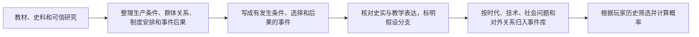
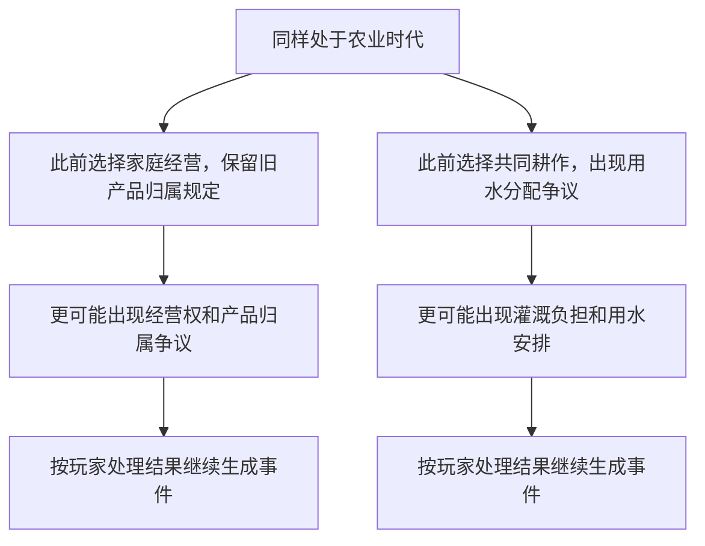

# 历史参考怎样变成地图事件库

【本轮确认】先参考已有历史事件建库，再根据玩家选择和现有背景计算概率，逐步拼成地图。本页列出编写办法与情境样例，不表示完整历史事件库已经建成。

## 一、先整理资料，再设计事件

【新增设计】每条资料记下名称、作者或出处、章节或链接、支持了哪一条因果判断。将“实际历史中发生了什么”与“游戏允许玩家尝试的另一种选择”分开写。不能把游戏分支当成史实，也不能将不同历史条件下的事件不加说明地拼在一起。

库的丰富程度不能只看条目数量。每个时代都应覆盖生产技术、所有制变化、人和人的生产关系、分配争议、制度与观念、对外关系及危机后恢复；同一关键问题要有不同背景的应对路径。正式库需要进一步收集、核对资料，目前样例只用于验证机制。

## 二、每条事件的编写表

| 要写清的内容 | 用处 |
| --- | --- |
| 历史参考与假设分支 | 说明哪些来自资料，哪些为游戏新增 |
| 具体前因 | 哪些技术、生产关系、诉求或对外事件已经发生 |
| 不允许出现的条件 | 没有雇佣关系不出现雇佣合同争议；没有对外争端不出现相关战争 |
| 更容易出现的背景 | 哪些已作出的选择增加该事件的概率，每项依据单独列出 |
| 情境与选项 | 明确当事方、争议规定和实际可执行方案，不统一套二选一 |
| 结果 | 生产力、三轴、制度、观念、历史背景分别怎样改变 |
| 对具体问题的处理 | 解决哪项、仅缓解哪项、留下哪项、新增哪项 |
| 失败与恢复 | 失败如何造成倒退，之后怎样继续生产和处理问题 |
| 再次出现的方式 | 日常活动可重复；一次性突破不重复领奖；未解决问题发展为后续事件 |

## 三、可供编写的情境样例

【新增设计】下表的历史参考只是资料检索方向，尚未完成出处核验。事件标题与分支为游戏情境，不指代某一场史实事件的全部原因。

| 历史参考方向 | 前面的游戏背景 | 候选事件 | 更容易出现的原因或关键后果 |
| --- | --- | --- | --- |
| 早期共同体生产 | 已有共同采集或共同狩猎 | 工具改进、共同劳动安排 | 持续共同生产使协作事件更常见 |
| 定居与农业形成 | 生产经验积累，达到发展条件 | 土地经营方式选择 | 选择影响以后的经营权与分配事件 |
| 农业经营关系变化 | 家庭经营扩大但旧归属规定不变 | 土地经营权与产品归属争议 | 家庭经营记录增加其出现机会 |
| 农业灌溉组织 | 已发展农业，需要公共水利 | 灌溉负担与用水安排 | 前次分配选择影响本次群体诉求 |
| 工场组织发展 | 已有生产分工与市场联系 | 扩大作坊协作或集中组织工场 | 不同方案改变三轴及后续候选 |
| 工业化与劳动保障 | 雇佣生产扩大，出现具体劳动诉求 | 工时、报酬与劳动保障争议 | 劳动条件恶化记录增加出现机会 |
| 劳动者集体行动 | 劳动诉求仍未处理 | 劳动者共同交涉 | 实际发生后才留下组织活动记录 |
| 政治制度变革 | 长期利益冲突、组织活动及变革诉求都存在 | 革命或政治变革 | 可以形成新制度，也可能失败并破坏生产 |
| 贸易与资源争端 | 前面作过排他贸易或资源争夺选择 | 边界、资源或贸易交涉 | 交涉失败记录成为后续战争的必要背景之一 |
| 战争与经济恢复 | 已有对外冲突且交涉失败或冲突升级 | 战争危机 | 可能停战、改制或继续损失；不是“旧制持续”的自动同义词 |
| 共同管理实践 | 共同管理已经形成，旧机构仍独占决策 | 生产管理权争议 | 修改具体权限，不必改全部三轴 |
| 信息与自动化生产 | 信息技术已应用，成果分配存在争议 | 技术成果归属与分配安排 | 制度、观念可以分别变化 |
| 社会治理与生产恢复 | 具体生产问题长期未解决，缺少战争或革命前因 | 生产中断与治理危机 | 提供与该问题相符的处理方案，避免凭空制造战争 |
| 灾后或战后恢复 | 本次关键事件造成实际生产损失 | 修复工具、设施和生产组织 | 只能补回本次损失，不靠反复危机刷收益 |

## 四、同一时代可以长出不同地图

时代相同不代表经历相同。背景只改变可能性和必要条件，不要求每一次游玩都复刻某一条历史路线。
