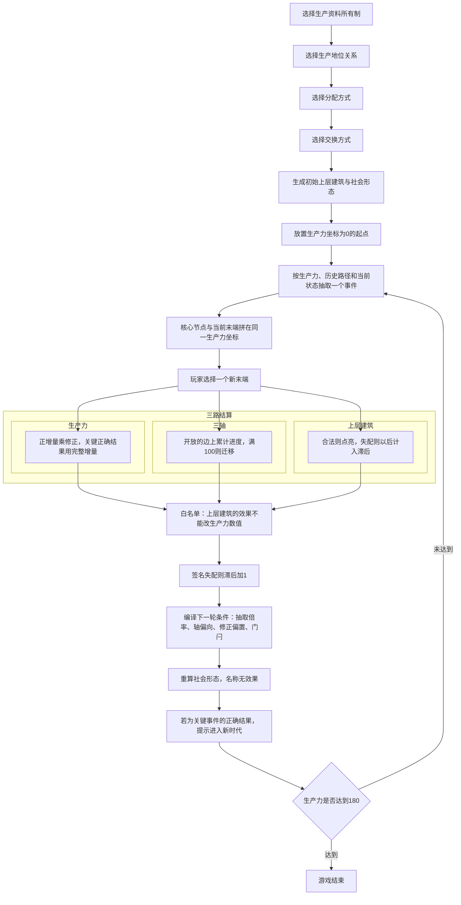

# 玩法链路

游戏从开局四级选择走到事件循环。抽取、拼接、选择是一条向下的链。生产力、三轴、上层建筑三路结算平行汇入白名单，之后只有一条线。生产力未到 180 时，这条线回到抽取；到了 180 就进入结束，不再绕回。

```mermaid
flowchart TB
  own["选择生产资料所有制"]
  status["选择生产地位关系"]
  dist["选择分配方式"]
  exchange["选择交换方式"]
  born["生成初始上层建筑与社会形态"]
  origin["放置生产力坐标为0的起点"]

  own --> status --> dist --> exchange --> born --> origin

  draw["按生产力、历史路径和当前状态抽取一个事件"]
  splice["核心节点与当前末端拼在同一生产力坐标"]
  choose["玩家选择一个新末端"]

  origin --> draw --> splice --> choose

  subgraph settle [三路结算]
    direction LR
    subgraph laneP [生产力]
      direction TB
      prod["正增量乘修正，关键正确结果用完整增量"]
    end
    subgraph laneB [三轴]
      direction TB
      axis["开放的边上累计进度，满100则迁移"]
    end
    subgraph laneS [上层建筑]
      direction TB
      super["合法则点亮，失配则以后计入滞后"]
    end
  end

  choose --> prod
  choose --> axis
  choose --> super

  white["白名单：上层建筑的效果不能改生产力数值"]
  lag["签名失配则滞后加1"]
  cond["编译下一轮条件：抽取倍率、轴偏向、修正偏置、门闩"]
  formName["重算社会形态，名称无效果"]
  eraHint["若为关键事件的正确结果，提示进入新时代"]
  check{"生产力是否达到180"}
  ending["游戏结束"]

  prod --> white
  axis --> white
  super --> white
  white --> lag --> cond --> formName --> eraHint --> check
  check -->|未达到| draw
  check -->|达到| ending
```

遇见事件的那一步停在拼接框里，生产力数值要到玩家选出末端之后才变。时代提示不另开一条回到抽取的线，它只是结算链上的一站。
