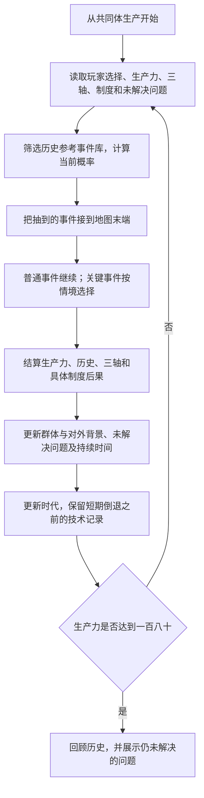
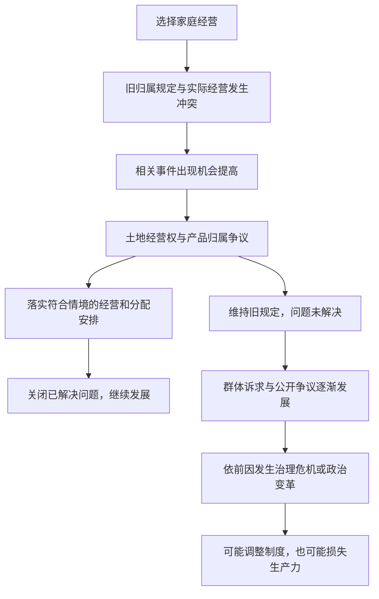

# 完整玩法链路

【原有整理】唯一起点、普通事件单出口、关键事件多结果、按生产力进入时代。

【本轮确认】事件先参考历史编入库，再根据玩家选择和背景计算出现概率；制度问题通过具体事件发展，长期不处理会引出相关危机。三轴为生产资料所有制关系、生产过程中人和人之间的关系、分配关系。

## 一、从事件库生成这一局的历史

只选择当前实际出现的事件。未选旧分支可以看，但不能跳回取得另一份结果。

## 二、一个具体例子：家庭经营以后发生什么

【新增设计】以下是一种可能的事件链，不是必定逐项发生的剧本。

| 已经发生的事 | 如何改变后续事件 |
| --- | --- |
| 玩家选择家庭经营农业，生产力达到20 | 家庭经营写入历史，三轴相应改变 |
| 产品仍按旧共同体规定处理 | 记录有具体当事方的产品归属问题，相关争议进入候选 |
| 抽到土地经营权与产品归属争议 | 提供确认家庭经营、改回共同经营并重订分配、维持旧规等符合情境的方案 |
| 玩家维持旧规 | 问题继续存在，不出现手动召回制度讨论的入口 |
| 后续事件继续发生，问题仍未解决 | 相关群体诉求更可能出现；到期时保证公开争议，再进一步发展成符合背景的危机 |
| 玩家后来通过事件达成可执行安排 | 只关闭确实处理的问题，改变后续事件概率 |
| 处理失败或继续对抗 | 可能停产、发生变革或生产力倒退；有实际损失时先安排恢复生产 |

这个例子没有对外冲突，不能仅因拖延就生成战争。如果另有资源争端和交涉失败，才有条件接入战争相关分支。

## 三、概率和必要的保障怎样配合

通常按背景概率抽事件。以下【新增设计】只负责防止一直没下一步：

- 问题持续三个回合仍未公开争议，安排一次相关公开争议；六个回合未解决，优先安排符合前因的严重危机。
- 有关键事件损失后，先安排两次恢复生产，期间暂停新的危机和问题持续计数。
- 达到发展条件后，连续两次合格机会未抽到突破，第三次提供突破。危机优先，原等待次数保留。
- 暂缓突破后，先经历两次其他事件再恢复其候选资格；不会永久删除机会。
- 连续两次非生产事件后，只要还未达到日常上限且没有到期危机，就提供正收益生产。

危机不是奖励。“支持革命”或“继续战争”不保证得到更好的制度，也不保证生产力上升。事件须提前说明可能后果；多种结果按该事件的背景概率结算。

## 四、界面要说明因果，不提供万能调整按钮

顶部显示生产力和时代，中间显示实际路径和当前事件，下方展示三轴、制度观念以及具体未解决问题。

问题可以查看起因、诉求和已持续多久，但没有点击后立即生成制度调整事件的操作。行动发生在实际出现的事件选项中。

回合说明示例：

> 你保留了旧产品归属规定。家庭经营者的诉求尚未解决，相关争议更可能在后续出现。这个问题已经持续两个回合。

危机说明示例：

> 前面的资源争端与交涉失败发展为战争危机。所选方案造成生产损失，生产力从九十六降到八十八；已掌握的机器技术仍保留，接下来先恢复受损生产。

具体数值与统一结算顺序见[规则说明](algorithms.md)。
