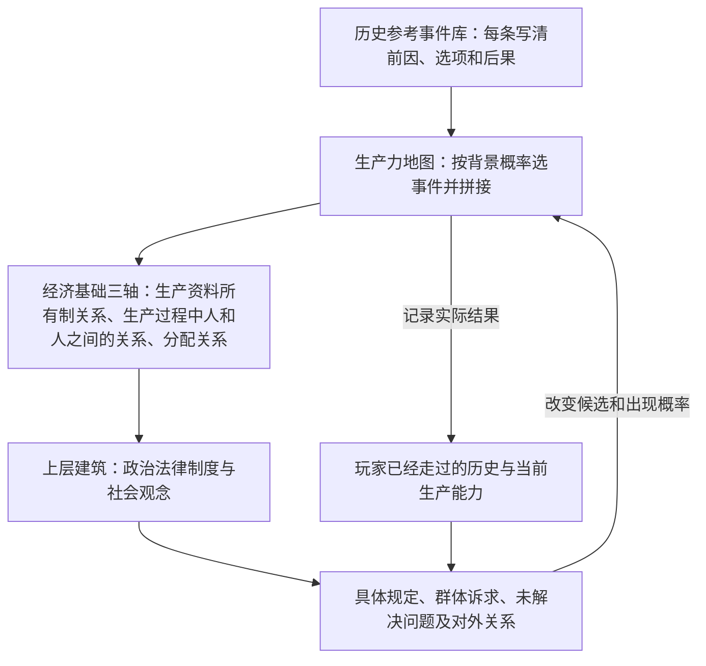
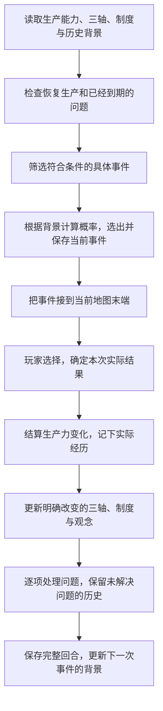

# 核心模块关系图

三模块仍为生产力地图、经济基础三轴、上层建筑。【本轮确认】地图中的事件来自历史参考库，概率随选择和背景变化；社会制度通过具体事件发展，而不是固定调整菜单。

## 一、三个模块如何形成反馈

【原有整理】地图与三轴图保留原稿思路。【新增设计】事件库是内容资料，回合流程负责调用，不另增加需要玩家理解的第四、第五个核心模块。

## 二、每个模块负责什么

| 模块 | 负责内容 | 对外提供 |
| --- | --- | --- |
| 生产力地图 | 历史参考库的候选筛选、背景概率、事件拼接、生产力和时代、实际经历 | 本次实际结果、当前能力、更新后的历史 |
| 经济基础三轴 | 生产资料所有制关系、生产过程中人和人之间的关系、分配关系及其变化 | 当前生产关系，哪些群体关系发生了变化 |
| 上层建筑 | 政治法律规定、社会观念、与制度相关的具体问题及其发展 | 对生产的影响、后续制度与危机事件的相关背景 |

问题和历史各只有一份共同的记录，三个模块不分别保存相互冲突的副本。事件库不直接改状态，只有实际选中的结果进入结算。

## 三、完整回合顺序

新制度从下一回合影响日常生产；战争破坏等是本次事件的直接后果。同一次事件只结算一次，不能给一个选项重复增加生产力。

## 四、为什么沿用旧制以后地图会改变

查看问题不是“召回制度调整”的按钮。危机类型取决于已有背景；长期拖延不会凭空产生从未出现过的组织、国家或对外敌手。
