# 模块链路

大模块套小模块。小模块只和本模块端口相连，彼此不连。跨模块的线只出现在端口上，并且只走相邻端口。

编号与 [algorithms.md](algorithms.md) 一致。历史条件写完以后，不另画一根横穿三列的回线。下一轮抽取时，回合端口把条件快照传给生产力端口，把轴偏向传给经济基础端口。

```mermaid
flowchart TB
  subgraph sched [调度]
    direction LR
    subgraph turnBox [事件循环]
      direction TB
      tPort["回合端口"]
      m61["M6.1 阶段机"]
      m62["M6.2 闭环时序"]
      tPort --> m61
      tPort --> m62
    end
    subgraph whiteBox [效果白名单]
      direction TB
      wPort["白名单端口"]
      m51["M5.1 来源与目标"]
      wPort --> m51
    end
  end

  subgraph domain [规则模块]
    direction LR
    subgraph prodBox [生产力]
      direction TB
      pPort["生产力端口"]
      m11["M1.1 时代提示"]
      m12["M1.2 事件抽取"]
      m13["M1.3 抽取权重"]
      m14["M1.4 核心拼接"]
      m15["M1.5 末端选择"]
      m16["M1.6 修正系数"]
      m17["M1.7 生产力数值"]
      m18["M1.8 历史前置"]
      pPort --> m11
      pPort --> m12
      pPort --> m13
      pPort --> m14
      pPort --> m15
      pPort --> m16
      pPort --> m17
      pPort --> m18
    end
    subgraph baseBox [经济基础]
      direction TB
      bPort["经济基础端口"]
      m21["M2.1 三轴状态"]
      m22["M2.2 所有制图"]
      m23["M2.3 生产地位图"]
      m24["M2.4 分配图"]
      m25["M2.5 边开放"]
      m26["M2.6 推进结算"]
      m27["M2.7 所有制约束"]
      m28["M2.8 张力"]
      m29["M2.9 初始分级"]
      m210["M2.10 选择载荷"]
      m211["M2.11 三轴签名"]
      bPort --> m21
      bPort --> m22
      bPort --> m23
      bPort --> m24
      bPort --> m25
      bPort --> m26
      bPort --> m27
      bPort --> m28
      bPort --> m29
      bPort --> m210
      bPort --> m211
    end
    subgraph supBox [上层建筑]
      direction TB
      sPort["上层建筑端口"]
      m31["M3.1 政治树"]
      m32["M3.2 观念树"]
      m33["M3.3 合法性"]
      m34["M3.4 结果点亮"]
      m35["M3.5 滞后与矛盾"]
      m36["M3.6 社会形态命名"]
      m37["M3.7 革命替换"]
      sPort --> m31
      sPort --> m32
      sPort --> m33
      sPort --> m34
      sPort --> m35
      sPort --> m36
      sPort --> m37
    end
    subgraph condBox [历史条件]
      direction TB
      cPort["历史条件端口"]
      m41["M4.1 条件编译"]
      m42["M4.2 权重合成"]
      m43["M4.3 门闩与修正读取"]
      cPort --> m41
      cPort --> m42
      cPort --> m43
    end
  end

  tPort -->|"调用，传入条件与历史路径"| pPort
  tPort -->|"调用，传入轴偏向与生产力坐标"| bPort
  tPort -->|"调用，传入三轴签名"| sPort
  tPort -->|"调用编译"| cPort
  tPort --> wPort
  pPort <-->|"生产力坐标与反作用"| bPort
  bPort <-->|"三轴签名与轴偏向"| sPort
  sPort -->|"写入条件"| cPort
```

## 端口依赖

- 回合端口按事件循环调用四个规则端口，并在写入前调用白名单。
- 生产力端口负责抽取、原位拼接、修正和时代提示。它接收条件快照，不接收上层建筑节点。
- 经济基础端口负责三级开局、三轴图，以及玩家所选末端上的轴载荷。
- 上层建筑端口根据签名生成和更新两层树，并把贡献写入历史条件。
- 历史条件端口只汇总、夹取和提供读取值。

生产力端口和上层建筑端口之间没有线。
